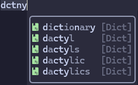

# 📚 blink-cmp-dictionary

<div align="center">

### 🎉 3.0 版本 - 零依赖！ 🎉

[English](./README.md) | **中文文档**

[](https://github.com/Kaiser-Yang/blink-cmp-dictionary/releases)

</div>

---

> 🚀 **3.0 新特性：** 享受**超快**的词典补全功能，**完全零外部依赖**！只需提供一个词典文件即可开始使用！⚡

[blink.cmp](https://github.com/Saghen/blink.cmp) 补全插件的词典源。让你可以在不离开编辑器的情况下查询词典。

## ✨ 特性

默认支持模糊查找：



📖 还支持单词释义（默认使用 `wn`）：


> [!NOTE]
> `wn` 是 `WordNet` 的缩写，这是一个英语词汇数据库。
> 如果你不知道如何安装 `wn`，可以搜索关键词
> `如何在...上安装 WordNet`。

## 🎯 要求

> 💎 **3.0 亮点：** 插件现在可以**开箱即用**，完全零外部依赖！只需提供一个词典文件即可享受闪电般快速的模糊补全！⚡

**可选的外部工具**（用于增强性能）：
- `fzf`、`rg` 或 `grep` - 用于更快的搜索（可选）
- `wn`（WordNet）- 用于单词释义（可选）

你可以使用 `checkhealth blink-cmp-dictionary` 来检查可选工具是否可用。

### 🚀 回退模式（纯 Lua - 零依赖！）

**默认行为：**
默认情况下，如果**未找到** `fzf`，插件将**直接回退**到纯 Lua 实现，而不是尝试 `rg` 或 `grep`。这提供了最佳的用户体验和出色的性能。

**🎁 为什么回退模式很棒：**
* ✅ **零外部依赖** - 到处都能工作！
* ✅ **超级快** - 即使是 90,000+ 词的词典也几乎感觉不到延迟
* ✅ **完整的模糊匹配** - 类似于 `fzf`，具有智能评分
* ✅ **跨平台** - 在任何有 Neovim 的系统上都能工作

**禁用回退：**
如果你希望在 `fzf` 不可用时使用 `rg` 或 `grep`，可以在配置中设置 `force_fallback = false`：

```lua
opts = {
    force_fallback = false,  -- fzf 未找到时尝试使用 rg/grep 而不是回退
}
```

> [!NOTE]
> 🎯 **性能：** 对 90,000 行词典文件的测试表明几乎没有可察觉的延迟。回退模式现在即使对于大型词典也是一个可行的选择！
> 
> 💬 如果你在回退模式下遇到任何性能问题，请[提交 issue](https://github.com/Kaiser-Yang/blink-cmp-dictionary/issues)。我们将实现异步执行模式来解决它们。

## 📦 安装

将插件添加到你的包管理器，并确保它在 `blink.cmp` 之前加载。

> [!TIP]
> 💡 **推荐：** 使用默认的 `force_fallback` 配置。插件会在 `fzf` 不可用时自动使用纯 Lua 回退模式，在所有场景下为你提供最佳性能！

### 🔌 lazy.nvim

**推荐配置（零依赖！）：**

```lua
{
    'saghen/blink.cmp',
    dependencies = {
        'Kaiser-Yang/blink-cmp-dictionary',
        -- ... 其他依赖
    },
    opts = {
        sources = {
            -- 将 'dictionary' 添加到列表中
            default = { 'dictionary', 'lsp', 'path', 'luasnip', 'buffer' },
            providers = {
                dictionary = {
                    module = 'blink-cmp-dictionary',
                    name = 'Dict',
                    min_keyword_length = 1,
                    opts = {
                        -- 可选：显式强制回退模式
                        -- （默认情况下，当找不到 fzf 时使用回退）
                        force_fallback = true,
                    }
                }
            },
        }
    }
}
```

**使用外部命令（增强性能）：**

```lua
{
    'saghen/blink.cmp',
    dependencies = {
        'Kaiser-Yang/blink-cmp-dictionary',
        -- ... 其他依赖
    },
    opts = {
        sources = {
            -- 将 'dictionary' 添加到列表中
            default = { 'dictionary', 'lsp', 'path', 'luasnip', 'buffer' },
            providers = {
                dictionary = {
                    module = 'blink-cmp-dictionary',
                    name = 'Dict',
                    -- 💡 min_keyword_length 的性能影响：
                    -- - 在回退模式下：无论值如何都不影响性能
                    -- - 使用 fzf：较高的值可能会提高性能
                    -- - 使用其他命令（rg/grep）：较高的值会显著提高性能
                    min_keyword_length = 1,
                    -- blink-cmp-dictionary 的选项
                    opts = {
                        -- 在这里放置你的词典文件
                        -- dictionary_files = {}
                    }
                }
            },
        }
    }
}
```

## 🚀 快速开始

> [!NOTE]
> 📖 如果你没有词典文件，请参见 [english-words](https://github.com/dwyl/english-words)。

默认情况下，你的词典文件必须是这样的内容（每行一个单词）：

```txt
word1
word2
```

如果你的词典文件是这样的，你只需要在配置中指定词典文件的路径：

```lua
-- 指定词典文件的路径
-- 示例：{ vim.fn.expand('~/.config/nvim/dictionary/words.dict') }
dictionary_files = nil,
-- 这些目录中的所有 .txt 文件将被视为词典文件
-- 示例：{ vim.fn.expand('~/.config/nvim/dictionary') }
dictionary_directories = nil,
```

> [!NOTE]
>
> ⚠️ `dictionary_files` 和 `dictionary_directories` 中的所有词典文件将被
> 连接在一起。确保文件不同，否则补全列表中会有
> 重复的单词。如果你的词典文件不是按行分隔的，
> 请参见[如何自定义补全项](#如何自定义补全项)

## ⚙️ 默认配置

请参见 [default.lua](./lua/blink-cmp-dictionary/default.lua)。

## 💡 常见问题

### 🔤 大小写的实际行为是什么？

从 `v2.0.0` 开始，有四个新选项：

* `capitalize_first`：
  - `true`：将补全项的第一个字母大写。
  - `false`：不将补全项的第一个字母大写。
* `capitalize_whole_word`：
  - `true`：将整个单词大写。
  - `false`：不将整个单词大写。
* `decapitalize_first`：
  - `true`：将补全项的第一个字母小写。
  - `false`：不将补全项的第一个字母小写。
* `decapitalize_whole_word`：
  - `true`：将整个单词小写。
  - `false`：不将整个单词小写。

大小写行为由所有选项共同决定。例如，如果它们的值都是 `true`、`true`、`true`、`true`。处理过程将是：（使用 `word` 作为示例）

* 将补全项的第一个字母大写：`Word`
* 将整个单词大写：`WORD`
* 将补全项的第一个字母小写：`wORD`
* 将整个单词小写：`word`

所以结果将是 `word`。

默认情况下，如果词典文件中的单词是小写的，并且匹配前缀的第一个字母是大写的，`capitalize_first` 将为 `true`；如果词典文件中的单词是小写的，并且匹配前缀的前两个字母是大写的，`capitalize_whole_word` 将为 `true`；`decapitalize_first` 和 `decapitalize_whole_word` 始终为 `false`。这意味着如果你的词典文件中有 `word`，并且你输入 `W`，补全项将是 `Word`。如果你输入 `WO`，补全项将是 `WORD`。如果你输入 `wo`、`wO`、`woR` 或 `wOr`，补全项将是 `word`。

### 📁 如何为不同的文件类型使用不同的词典？

你只需要使用函数来确定不同文件类型的词典文件，例如：

```lua
dictionary_files = function()
    if vim.bo.filetype == 'markdown' then
        return { vim.fn.expand('~/.config/nvim/dictionary/markdown.dict') }
    end
    return { vim.fn.expand('~/.config/nvim/dictionary/words.dict') }
end,
```

### 🔍 为什么默认使用 `fzf`？`blink.cmp` 已经支持模糊查找

在 `blink-cmp-dictionary` 中，我们使用 `get_prefix` 来确定搜索哪一部分。如果我们不使用 `fzf`，例如我们使用 `rg` 或 `grep`，并且我们设置 `min_keyword_length=3`。在输入 'dic' 后，`blink.cmp` 将获取所有以 'dic' 开头的单词，然后 `blink.cmp` 将对以 'dic' 开头的单词进行模糊查找。这个过程使得在输入 'dit' 时无法补全 'dictionary'。但如果我们使用 `fzf`，当输入 `dit` 时 `fzf` 将返回 'dictionary'（'dit' 是 'dictionary' 的子序列）。所以模糊查找功能得到了完全支持。

请注意，当 `fzf` 和 `rg` 都不可用时，`grep` 作为最后的回退选项提供，但它不会提供与 `fzf` 相同级别的模糊匹配。

### 🎨 如何自定义补全项

默认情况下，`blink-cmp-dictionary` 将词典文件中的每一行视为一个补全项。你可以通过在配置中使用 `separate_output` 来更新此行为：

```lua
separate_output = function(output)
    local items = {}
    -- 你可能需要更改模式以匹配你的词典文件
    for line in output:gmatch("[^\r\n]+") do
        local items = {}
        for line in output:gmatch("[^\r\n]+") do
            table.insert(items, line)
        end
        return items
    end
    return items
end
```

在调用 `separate_output` 后，`blink-cmp-dictionary` 将为列表中的每个项调用 `get_label`、`get_insert_text`、`get_documentation` 和 `get_kind` 来组装补全项。以下是默认值：

```lua
get_label = function(item)
    return item
end,
get_insert_text = function(item)
    return item
end,
get_kind_name = function(_)
    return 'Dict'
end,
get_documentation = function(item)
    -- 使用 return nil 来禁用文档
    -- return nil
    return {
        get_command = function()
            return utils.command_found('wn') and 'wn' or ''
        end,
        get_command_args = function()
            return { item, '-over' }
        end,
        resolve_documentation = function(output)
            return output
        end,
        on_error = default_on_error,
    }
end,
```

### 🛠️ 如何自定义命令

默认情况下，`blink-cmp-dictionary` 将使用原生 Neovim 异步文件 I/O 读取词典文件并将它们传输到搜索工具。

**默认行为：**
- 如果找到 `fzf` → 使用 `fzf` 进行模糊搜索
- 如果**未找到** `fzf` → **直接回退到纯 Lua 实现**
- 这提供了出色的性能，无需外部工具

**禁用回退（在找不到 fzf 时使用 rg/grep）：**
如果你希望在 `fzf` 不可用时尝试 `rg` 或 `grep`：

```lua
opts = {
    force_fallback = false,  -- 直接回退而不是尝试 rg/grep
    -- blink-cmp-dictionary 的其他选项
}
```

**强制回退模式：**
你可以在 `fzf` 可用时强制使用回退模式：

```lua
opts = {
    force_fallback = true,   -- 始终使用纯 Lua 实现
    -- blink-cmp-dictionary 的其他选项
}
```

**回退模式性能：**
- 执行**模糊匹配**（类似于 `fzf`）同步但具有智能评分
- 即使对于大型词典也有**出色的性能**（对 90,000 行文件的测试显示几乎没有可察觉的延迟）
- 如果遇到性能问题，请[提交 issue](https://github.com/Kaiser-Yang/blink-cmp-dictionary/issues) - 我们可以实现异步执行

**自定义命令：**
你可以配置一个支持直接从文件读取的新命令，例如 `rg`：

```lua
-- 将它们设置为 nil 以将文件直接传递给命令
dictionary_files = nil,
dictionary_directories = nil,
get_command = 'rg',
get_command_args = function(prefix, _)
    local dictionary_file1 = 'path/to/your/dictionary/file1'
    local dictionary_file2 = 'path/to/your/dictionary/file2'
    return {
        '--color=never',
        '--no-line-number',
        '--no-messages',
        '--no-filename',
        '--smart-case',
        '--',
        prefix,
        -- 将词典文件传递给命令
        dictionary_file1,
        dictionary_file2,
    }
end
```

如果你只想自定义 `fzf` 的参数，例如，下面将忽略大小写：

```lua
get_command_args = function(prefix, _)
    return {
        '--filter=' .. prefix,
        '--sync',
        '--no-sort',
        '-i' -- -i 忽略大小写，+i 尊重大小写，没有这行是智能大小写
    }
end,
```

### 🎨 如何自定义高亮

自定义 `BlinkCmpKindDict` 来自定义种类图标的高亮，这是一个示例：

```lua
vim.api.nvim_set_hl(0, 'BlinkCmpKindDict', { default = false, fg = '#a6e3a1' })
```

### 🎯 如何仅为注释块或特定文件类型启用此插件？

更新 `blink.cmp` 的 `default`：

```lua
-- 使用此函数检查光标是否在注释块内
local function inside_comment_block()
    if vim.api.nvim_get_mode().mode ~= 'i' then
        return false
    end
    local node_under_cursor = vim.treesitter.get_node()
    local parser = vim.treesitter.get_parser(nil, nil, { error = false })
    local query = vim.treesitter.query.get(vim.bo.filetype, 'highlights')
    if not parser or not node_under_cursor or not query then
        return false
    end
    local row, col = unpack(vim.api.nvim_win_get_cursor(0))
    row = row - 1
    for id, node, _ in query:iter_captures(node_under_cursor, 0, row, row + 1) do
        if query.captures[id]:find('comment') then
            local start_row, start_col, end_row, end_col = node:range()
            if start_row <= row and row <= end_row then
                if start_row == row and end_row == row then
                    if start_col <= col and col <= end_col then
                        return true
                    end
                elseif start_row == row then
                    if start_col <= col then
                        return true
                    end
                elseif end_row == row then
                    if col <= end_col then
                        return true
                    end
                else
                    return true
                end
            end
        end
    end
    return false
end

-- 这是 blink.cmp 的 opts
---@module 'blink.cmp'
---@type blink.cmp.Config
opts = {
    sources = {
        default = function()
            -- 放置始终显示的内容
            local result = {'lsp', 'path', 'luasnip', 'buffer' }
            if
                -- 在 markdown 或 text 文件中开启词典
                vim.tbl_contains({ 'markdown', 'text' }, vim.bo.filetype) or
                -- 或者如果光标在注释块中则开启词典
                inside_comment_block()
            then
                table.insert(result, 'dictionary')
            end
            return result
        end,
    }
}
```

## ⚡ 性能

**默认模式：**
- 如果找到 `fzf`：使用 `fzf`（异步，无阻塞）
- 如果**未找到** `fzf`：使用**回退模式**（同步，但性能出色）✨

**使用外部命令：**
使用外部命令（`fzf`、`rg` 或 `grep`）时，`blink-cmp-dictionary` 异步运行且不会阻塞其他操作。

**使用回退模式（找不到 fzf 时的默认模式）：**
使用回退模式（无外部命令）时，插件执行**同步**过滤但具有**出色的性能**。对 90,000 行词典文件的测试显示几乎没有可察觉的延迟。性能问题现在几乎不存在，使回退模式即使对于大型词典也是一个可行的选择！🚀

> [!TIP]
> 💬 如果你在回退模式下遇到任何性能问题，请[提交 issue](https://github.com/Kaiser-Yang/blink-cmp-dictionary/issues)。我们将实现异步执行模式来解决它们。

**性能调优：**

- **`min_keyword_length`**： 
  - 在**回退模式**下：无论值如何都不影响性能 ✅
  - 使用 **fzf**：较高的值可能会提高性能
  - 使用**其他命令**（rg/grep）：较高的值会显著提高性能

- **`max_items`**：较小的值在所有模式下都能获得更好的性能。这是因为 blink.cmp 的模糊匹配（在返回词典结果后发生）会处理这些项 - 更多的项需要下游更多的处理时间。

**示例配置：**

```lua
opts = {
    sources = {
        providers = {
            dictionary = {
                module = 'blink-cmp-dictionary',
                name = 'Dict',
                min_keyword_length = 1,  -- 根据你的搜索命令调整
                -- 较小的值普遍提高性能
                max_items = 8, -- blink-cmp-dictionary 将继承此值，默认值为 100
            }
        },
    }
}
```

## 📌 版本说明

发布版本的格式为 `major.minor.patch`。当这些数字之一增加时：

* `patch`：🐛 修复了错误或添加了文档。这不会破坏兼容性。
* `minor`：✨ 添加了兼容的功能。这可能会导致某些配置 `deprecated`，但不会破坏兼容性。
* `major`：🚀 添加了不兼容的功能。所有 `deprecated` 的配置将被删除。这将破坏兼容性。

## 🙏 致谢

优秀且快速的补全插件：[blink.cmp](https://github.com/Saghen/blink.cmp)。

灵感来自 [cmp-dictionary](https://github.com/uga-rosa/cmp-dictionary)。

从 [blink-ripgrep.nvim](https://github.com/mikavilpas/blink-ripgrep.nvim) 学习了如何编写源。

---

<div align="center">

**⭐ 如果你觉得这个项目有用，请给它一个 Star！⭐**

用 ❤️ 由社区制作

</div>
